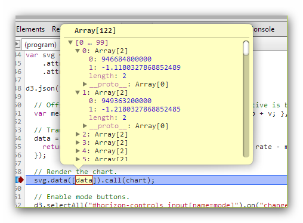

# Why Custom?

<style>
body{
  font-family: 'Oxygen', sans-serif;
  font-size: 15px;
  line-height: 22px;
}

h1,h2,h3,h4 {
  font-family: 'Raleway', sans-serif;
}
</style>


[`rCharts`](http://rcharts.io/site) provides almost every chart type imaginable through multiple js libraries.  The speed at which it has added libraries shows that the authors are well aware of the quick pace of innovation in the visualization community especially around [d3.js](http://d3js.org).  It is foolish to think though that every chart in every combination with every interaction will be available, so fortunately `rCharts` is designed to also easily accommodate custom charts.

There are already some very impressive conversions of complicated NY Times Interactive pieces, but I thought it would be helpful to show how we might convert a more basic chart type with less moving parts.  Since I love horizon plots (summarized in [Horizon Plots with plot.xts](http://timelyportfolio.blogspot.com/2012/08/horizon-plots-with-plotxts.html) and explained in [More on Horizon Charts](http://timelyportfolio.blogspot.com/2012/08/more-on-horizon-charts.html)), the [horizon plot d3 plugin](https://github.com/d3/d3-plugins/blob/master/horizon/horizon.js) from Jason Davies will be a lovely target.

This tutorial will go in depth to explain some of the inner workings of `rCharts` as we work through an implementation of d3 horizon plots.  We will see how `rCharts`
- uses [mustache templates](http://mustache.github.io/) through the R package [`whisker`](https://github.com/edwindj/whisker) to bind html/js with `R,
- employs [YAML](http://www.yaml.org/) through the R package [`yaml`](http://cran.r-project.org/web/packages/yaml/index.html) for configuration, and
- passes data and parameters with [`RJSONIO`](http://cran.r-project.org/web/packages/RJSONIO/index.html).


### Disclaimer and Attribution

**Much of this work is based on the [horizon plot plugin](https://github.com/d3/d3-plugins/blob/master/horizon/horizon.js) by Jason Davies and the [example](http://bl.ocks.org/mbostock/1483226) by Mike Bostock.** 

```{r echo=F, warning= F, message=F}
opts_chunk$set(
  message = FALSE,
  warning = FALSE,
  error = FALSE,
  tidy = FALSE,
  cache = FALSE,
  results = 'asis'
)
```


---.RAW
### rCharts Innards
<h4>A Naked rChart</h4>
What does a naked rChart look like?

```{r}
#if you do not have rCharts or if you have an outdated version
#require(devtools)
#install_github('rCharts', 'ramnathv')
require(rCharts)
rChart <- rCharts$new()
str(rChart)
```
Only if it matters to you, a [`rChart`](https://github.com/ramnathv/rCharts/blob/master/R/rChartsClass.R) is a [R5 object or reference class](https://github.com/hadley/devtools/wiki/R5).  If it doesn't matter to you, just forget what I just said.  As the `str` output tells us, this rChart has 8 fields and 24 methods (functions), of which 12 "are possibly relevant".  I am guessing some like `width` and `height` do not need much explanation, but the others might not be immediately understood.  Since I learn by breaking, what happens if we call `rChart`?

```{r message = T, error = F}
rChart
```

<h4>Templates with Mustaches</h4>

Darn it didn't work, but we did get a clue `/layouts/chart.html`.  This falls into the `templates` field in the `str` output above and looks like a file and directory.  I guess it would be wise to inspect this `templates` field.  In it, we find `page`, `chartDiv`, and `script`.  `page` and `script` look like html files, so let's find out where these are and what's inside.  `page` is defined as rChart.html, which is inside your `R` rCharts package.  You can see for yourself by typing the following in `R`:

```{r eval = F}
readLines(system.file('rChart.html', package = 'rCharts'))
```

or you can also find the rChart.html [here in source](https://github.com/ramnathv/rCharts/blob/master/inst/rChart.html).

```
<!doctype HTML>
<meta charset = 'utf-8'>
<html>
  <head>
    {{# assets.css }}
    <link rel='stylesheet' href='{{{ . }}}'>
    {{/ assets.css }}
    
    {{# assets.jshead }}
    <script src='{{{ . }}}' type='text/javascript'></script>
    {{/ assets.jshead }}
    
    <style>
    .rChart {
      display: block;
      margin-left: auto; 
      margin-right: auto;
      width: {{params.width}}px;
      height: {{params.height}}px;
    }  
    </style>
    
  </head>
  <body>
    {{# chartId }}
    <{{container}} id='{{chartId}}' class='rChart {{ lib }}'></{{container}}>  
    {{/ chartId }}
    
    {{{ script }}}
    
  </body>
</html>
```

All the `{{{ }}}` provide some of the magic behind rCharts.  These multiple `{{{ }}}` are mustaches and get filled through the `R` package [`whisker`](https://github.com/edwindj/whisker) as described in the `whisker` [Readme.md](https://github.com/edwindj/whisker/blob/master/readme.md).

<blockquote>Whisker is a {{Mustache}} implementation in R confirming to the Mustache specification. Mustache is a logicless templating language, meaning that no programming source code can be used in your templates. This may seem very limited, but Mustache is nonetheless powerful and has the advantage of being able to be used unaltered in many programming languages. It makes it very easy to write a web application in R using Mustache templates which could also be re-used for client-side rendering with "Mustache.js".

Mustache (and therefore whisker) takes a simple, but different, approach to templating compared to most templating engines. Most templating libraries, such as Sweave, knitr and brew, allow the user to mix programming code and text throughout the template. This is powerful, but ties your template directly to a programming language and makes it difficult to seperate programming code from templating code.

Whisker, on the other hand, takes a Mustache template and uses the variables of the current environment (or the supplied list) to fill in the variables.
</blockquote>

So all these multiple mustaches `{{{ }}}` get shaven and replaced with `R` variables or function output.  For instance, the mustached `{{ chartId }}` will get populated by the R variable `chartId`.  This gets assigned in the [`render` method](https://github.com/ramnathv/rCharts/blob/master/R/rChartsClass.R#L64) `chartId = params$dom`.  If we look back at our `str` output above we see

```
$ params   :List of 3
   ..$ dom   : chr "chart249c23a11dcc"
```
so once we fix our error (nope, still haven't even come close to fixing), we should see this is our html output.  Now let's see why our mustache is full of [YAML](http://www.yaml.org/).

<h4>Mustache Full of YAML</h4>
If we are working with html/js, we have to expect some js and css file dependencies that we will need to load.  `rCharts` looks for a [YAML](http://www.yaml.org/) file config.yml to tell us the location for all these js and css files.  This [line]([YAML](https://github.com/ramnathv/rCharts/blob/master/R/rChartsClass.R#L63)

```
 assets = get_assets(LIB, static = T, cdn = cdn)
```

calls this [line](https://github.com/ramnathv/rCharts/blob/master/R/utils.R#L34)

```
get_assets <- function(LIB, static = T, cdn = F){
  config = yaml.load_file(file.path(LIB$url, 'config.yml'))[[1]]
```

which parses the YAML for our js and css file locations.  As an example, below is the [config.yml](https://github.com/ramnathv/rCharts/blob/master/inst/libraries/nvd3/config.yml) for the `rCharts` implementation of `NVD3`.

```
nvd3:
  css: [css/nv.d3.css, css/rNVD3.css]
  jshead: [js/jquery-1.8.2.min.js, js/d3.v3.min.js, "js/nv.d3.min-new.js", js/fisheye.js]
  cdn:
    css: http://nvd3.org/src/nv.d3.css
    jshead: 
      - "http://ajax.googleapis.com/ajax/libs/jquery/1.8.3/jquery.min.js"
      - "http://d3js.org/d3.v2.min.js"
      - "http://nvd3.org/nv.d3.js"
      - "http://nvd3.org/lib/fisheye.js"
```
`rCharts` is smart enough to handle the css and js for both a local rendering and a rendering which might be happier served from a CDN.  `whisker` and `mustache` are smart enough to handle array type structures to list each file if there is more than one file.

You might wonder if we will ever fix our error and see a horizon plot.  Let's do both at the same time in the next section.

---.RAW
### Convert the Horizon
<h4>Finally, Fix Our Error and Start to See the Horizon</h4>
The reason for our error
```
## Warning: cannot open file '/layouts/chart.html': No such file or directory
```
is mustache tries to fill the `{{{ script }}}` portion of rChart.html with a file specified by  which is

```{r}
rChart$templates$script
```
which might or might not exist.  We can get away with not specifying the location of `templates$page` (rChart.html).  It is designed to be fairly universal, so there is a default in the rCharts package, but the script template for each library or custom implementation will be different.  In each of the library implementations, `templates$script` will be populated at initialization in these [two lines of code](https://github.com/ramnathv/rCharts/blob/master/R/rChartsClass.R#L8).
```
lib <<- tolower(as.character(class(.self)))
LIB <<- get_lib(lib) # library name and url to library folder
```
Here is the [chart.html script template](https://github.com/ramnathv/rCharts/blob/master/inst/libraries/nvd3/layouts/chart.html) for NVD3, which `rCharts` will assume is in libraries/nvd3/layouts/ directory, since the reference class for NVD3 is called Nvd3 [`setRefClass('Nvd3'...`](https://github.com/ramnathv/rCharts/blob/master/R/Nvd3.R#L7).

<h4>Roll Your Own Template</h4>

For custom charts, we will need to write our own script (easy enough usually with a lot of copy/paste) and tell rCharts where to find it.  We could put it anywhere.  For this tutorial, I will be using the `R` package [slidify](http://slidify.org) which will prefer that my directory is in /libraries/widgets/.  To be original I will name my widget d3_horizon and my script template d3_horizon.html, so the full directory will be /libraries/widgets/d3_horizon/layouts/d3_horizon.html.  Here is how we would tell `rCharts` to find our custom template.

```{r}
rChart$setLib('libraries/widgets/d3_horizon')
rChart$setTemplate(script = "libraries/widgets/d3_horizon/layouts/d3_horizon.html")
```

As I said, the script template usually will be a lot of copy/paste if you are trying to recreate something you have seen.  For the horizon plot, let's copy/paste from this example by [Mike Bostock](http://bl.ocks.org/mbostock/1483226).

<h4>Draw a Mustache on Your Copy/Paste</h4>

The basic process is find each of the variables or parameters we would like to define in `R`.  All of the parameters for our horizon plot are nicely provided in the [first couple lines of code](https://github.com/d3/d3-plugins/blob/master/horizon/horizon.js#L3) in the horizon.js plugin.

```
    var bands = 1, // between 1 and 5, typically
        mode = "offset", // or mirror
        interpolate = "linear", // or basis, monotone, step-before, etc.
        x = d3_horizonX,
        y = d3_horizonY,
        w = 960,
        h = 40,
        duration = 0;
```

In R, we can set these with `set` like this

```{r}
rChart$set(
  bands = 3,
  mode = "mirror",
  interpolate = "basis",
  width = 700,
  height = 300
)
```
and all of these will go into the `rCharts$params` list.  Remember our powerful and sexy mustache.  We can get these parameters with it.  Just triple mustache `{{{ params }}}`.

Now let's find the relevant parts of the code from the example.

```
var chart = d3.horizon()
    .width(width)
    .height(height)
    .bands(1)
    .mode("mirror")
    .interpolate("basis");

var svg = d3.select("body").append("svg")
    .attr("width", width)
    .attr("height", height);
    
...

// Render the chart.
svg.data([data]).call(chart);
```
We will change them just slightly to the following.

```
var params = {{{ chartParams }}};

var svg = d3.select('#' + params.id).append("svg")
    .attr("width", params.width)
    .attr("height", params.height);
    
var chart = d3.horizon()
    .width(params.width)
    .height(params.height)
    .bands(params.band)
    .mode(params.mode)
    .interpolate(params.interpolate);
    
svg.data(params.data).call(chart)
```

If you are following along at home, copy and paste that into your script template chart.html.  You can see mine [here](https://github.com/timelyportfolio/rCharts_d3_horizon/blob/gh-pages/libraries/widgets/d3_horizon/layouts/d3_horizon_no_data.html).

<h4>Supply the Data</h4>
Those paying real close attention will know `params$data` has not been defined.  Let's supply some data in the form of rolling 12-month returns on the S&P 500.

```{r warning = F}
require(quantmod)
#get sp500 prices and convert them to monthly
SP500 <- to.monthly(
  getSymbols("^GSPC", from = "1990-01-01", auto.assign = FALSE)
)
#get 12 month rolling return
SP500.ret <- na.omit(ROC(SP500[,4], type = "discrete", n = 12))
SP500.df <- cbind(
  as.numeric(as.POSIXct(as.Date(index(SP500.ret)))),
  coredata(SP500.ret)
)
colnames(SP500.df) <- c("date","SP500")

#supply the data to our dataless but no longer naked rChart
rChart$set(data = SP500.df)
```
You might think we are done, but if you call `rChart` our error is fixed, but we get a new error in the browser because we did not transform our data.  This is a common, sometimes easily fixed, sometimes very difficult piece.  If we debug the example, we will see the data is provided as an array of arrays.



Real quickly, now is a great time to cover how everything is converted from R vectors, lists, data.frames, etc. to javascript.  This all happens with the R package [`RJSONIO`](http://cran.r-project.org/web/packages/RJSONIO/index.html).  In this case, our `params$data` is converted to `JSON` as an array of objects.

We will need to allow an `x` and `y` to be specified in `R`

```{r}
rChart$set(x = "date", y = "SP500")
```

and write a simple javascript `map` transform to do the conversion in our script template

```
data = [params.data.map(function(d) {return[d[params.x],d[params.y]]})];

svg.data(data).call(chart);
```
Just one last final item.  We need to supply a config.yml for `rCharts` to know where we have copied d3js and the horizon plugin.  It should look something like this.
```
d3_horizon:
  jshead: [js/d3.v3.js,js/horizon.js]
  cdn:
    jshead: 
      - "http://d3js.org/d3.v3.min.js"
      - "http://timelyportfolio.github.io/rCharts_d3_horizon/libraries/widgets/js/d3_horizon/horizon.js"

```


---
### Our Horizon Chart
Now for the magic moment.

```{r}
rChart
```

---
### Thanks
As I hope you can tell, this post was more a function of the efforts of others than of my own.

Thanks specifically:
- Ramnath Vaidyanathan for [rCharts](http://rcharts.io/site) and [slidify](http://slidify.org).
- [Jason Davies](http://www.jasondavies.com/) for the [Horizon Chart d3 plugin](https://github.com/d3/d3-plugins/blob/master/horizon/horizon.js) and all his contributions and examples.
- [Mike Bostock](http://bost.ocks.org/mike/) for everything.
- Google fonts [Raleway](http://www.google.com/fonts/specimen/Raleway) and [Oxygen](http://www.google.com/fonts/specimen/Oxygen)
